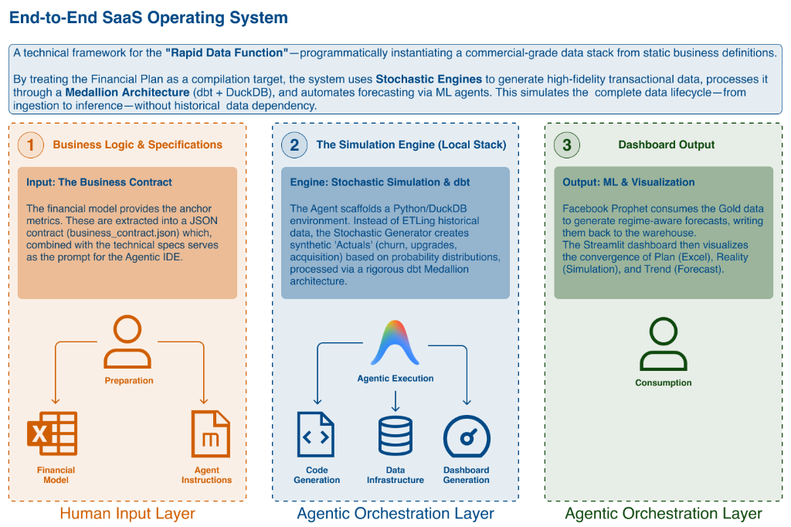
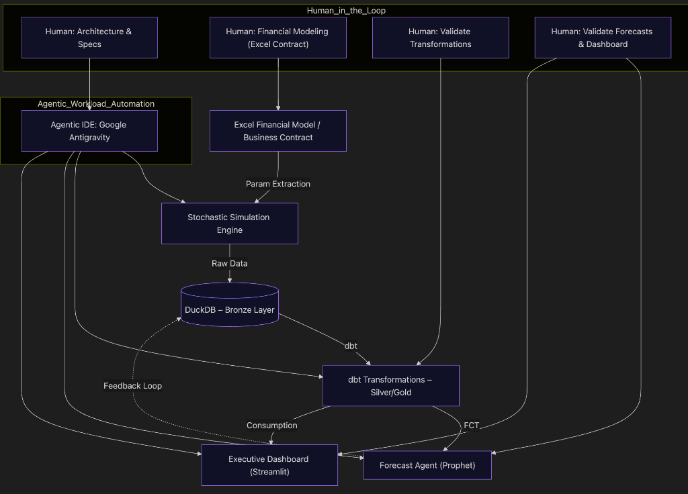
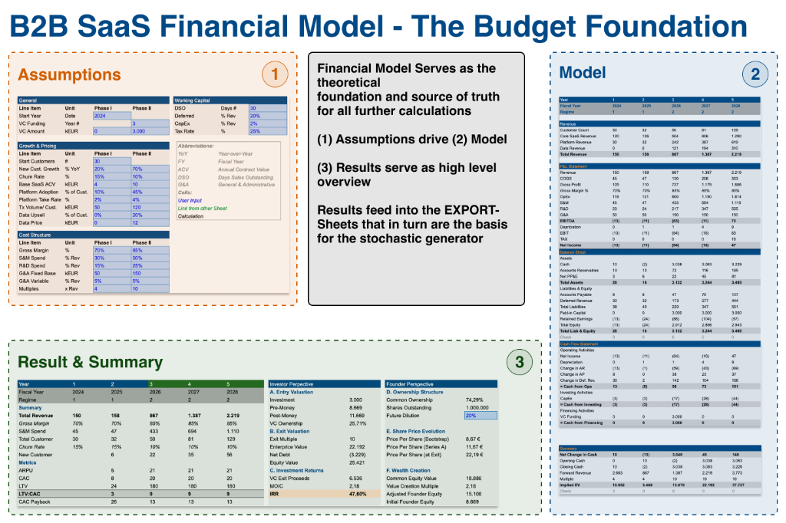
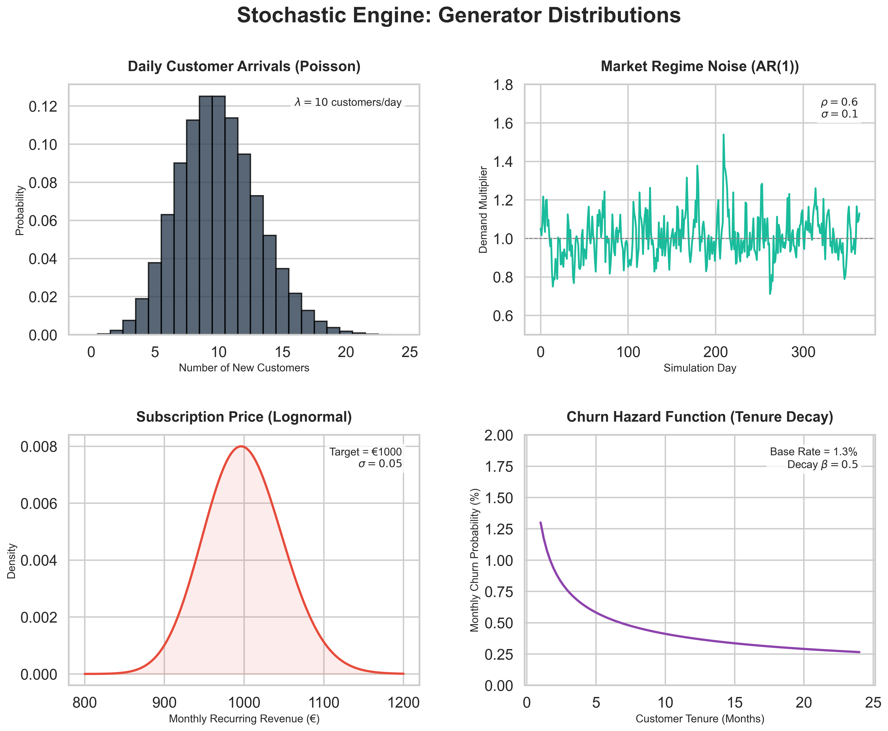
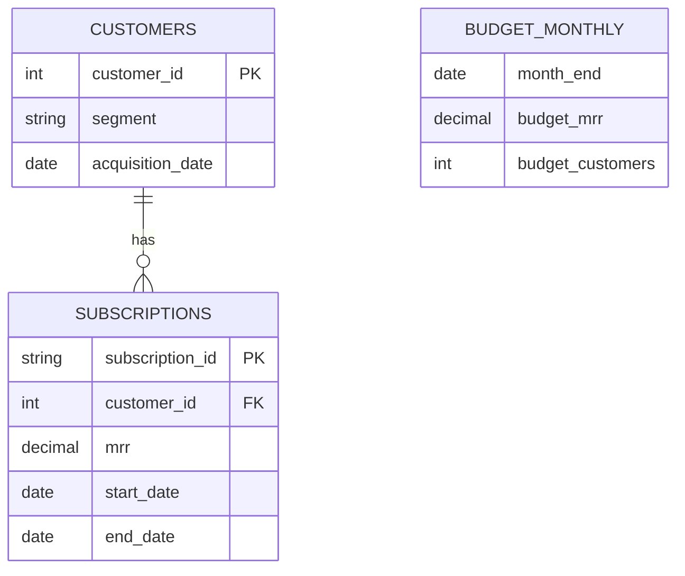
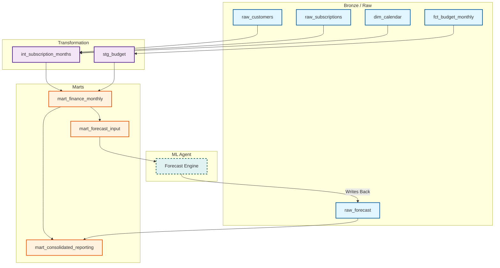

# Agentic Financial Twin: Rapid Data Function POC 🚀


> **Building a commercial-grade Financial Data Platform in hours, not weeks, using Agentic Workflow.**

## 📖 About


This project is a Proof of Concept (POC) for a **"Rapid Data Function"**—instantiating an entire end-to-end data stack (Stochastic Simulation, Data Warehouse, Algorithmic Forecasting, and BI) purely from a static business definition.

By treating the "Business Contract" (Excel Model) as code, we compile strategy into a living **Financial Digital Twin** that simulates daily operations, scales data engineering via dbt, and performs autonomous forecasting.

## 🤖 The Agentic Workflow
This repository was built using a highly structured **Agent-Assisted** methodology, maximizing the "Context Window" efficiency of LLMs to go from Idea to Execution rapidly.

1.  **Ideation & Alignment**: Brainstorming with **ChatGPT** until the specific "Financial Digital Twin" concept was locked.
2.  **Context Storage**: Structuring the domain knowledge into Markdown modules within an **Obsidian Vault**.
3.  **Retrieval Layer**: Uploading the vault to **NotebookLM** to act as a RAG (Retrieval-Augmented Generation) interface for the project specs.
4.  **Specification**: Using the RAG layer to synthesize a final, technically rigorous "Spec Sheet" (`Downspec.md`).
5.  **Execution**: Feeding the specs into an **Agentic IDE** (e.g., Cursor/Windsurf) to implement the stack, referencing specific context headers.

## 🏗 Architecture
A modern, self-contained data stack running locally:



## 📊 Financial Model Foundation
At the heart of the system is the **Business Contract**—a structured extraction of the Excel Operating Plan. This serves as the single source of truth, defining the assumptions (churn, growth, pricing) and the targets that the Stochastic Engine must simulate against.



## ⚙️ Generator Dynamics
The simulation engine relies on the following stochastic distributions to model real-world variance:



## ⚡️ Key Features
-   **Contract-First Engineering**: The entire simulation scales dynamically based on `business_contract.json` extracted from the Excel Operating Plan.
-   **Stochastic Engine**: Simulates Customer Acquisition (Poisson), Retention (Hazard/Survival), and Revenue expansion (Repricing Regimes).
-   **Medallion DWH**: A rigorous `dbt` project structure (Bronze/Silver/Gold) ensuring clean lineage and correct MRR calculations.
-   **Regime-Aware Forecasting**: A `Prophet` model that detects "Growth Regimes" to avoid overfitting on early-stage data.
-   **Three-Pronged BI**: Visualizes the **Plan** (BUD), the **Reality** (ACT), and the **Trend** (FCT) in one unified dashboard.

## 🗄️ Data Warehouse Structure

### Entity Relationship Diagram (ERD)
The core schema centers on the **Subscription** entity, which captures the lifecycle of revenue generation.



### dbt Lineage & Information Flow
Data flows from the Stochastic Engine into the Bronze Layer, transforms into Monthly Recurring Revenue (MRR) ledgers in Silver, and aggregates for Reporting/ML usage in Gold. The Forecast Agent consumes Gold data and writes back predictions to complete the loop.



## 🛠 Tech Stack
-   **Code**: Python 3.11
-   **Database**: DuckDB (OLAP)
-   **Transformations**: dbt (Data Build Tool)
-   **ML/Forecasting**: Facebook Prophet
-   **Visualization**: Streamlit & Plotly Express

## 🚀 Quick Start

1.  **Install Dependencies**
    ```bash
    pip install -r requirements.txt
    ```

2.  **Run the Simulation Engine**
    ```bash
    # Extracts contract, runs simulation, builds dbt models, runs forecast
    python generator.py && cd dbt_financial && dbt run && cd .. && python forecast_model.py
    ```

3.  **Launch the Dashboard**
    ```bash
    streamlit run dashboard.py
    ```

---
*Created as a demonstration of Agentic Engineering capabilities.*
