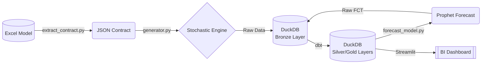
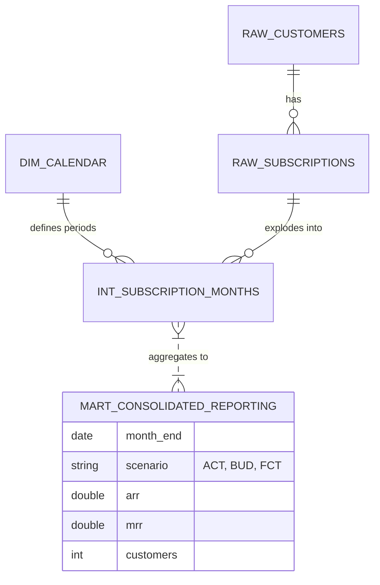

# Financial Digital Twin: Project Overview

## 1. Executive Summary
This project implements a **Financial Digital Twin**, a sophisticated simulation engine that bridges the gap between static Excel financial models and modern data engineering. 

**Intent**: To translate a 5-Year Operating Plan (Excel) into a granular, stochastic daily simulation, creating a "clean" data warehouse environment (ACT, BUD, FCT) that mimics a real-world SaaS company's data stack. This allows for rigorous validation of the business plan against realistic operational volatility and enables advanced "What-If" analysis.

## 2. System Architecture
The data flows from a static contract (Excel) through a Python simulation engine, into a DuckDB data warehouse transformed by dbt, enhanced by ML forecasting, and visualized in Streamlit.

---

## 3. Data Generation (Stochastic Engine)
The `generator.py` script is not a simple linear interpolator. It simulates the **operational reality** of a SaaS business to generate the "Actuals" (ACT).

### Key Mechanisms:
1.  **Steering Control Loop**:
    -   The system reads the annual "Target Customers" from the contract.
    -   Every month, it calculates the "Gap to Target" and adjusts the daily acquisition rate dynamically, similar to how a VP of Sales would adjust quotas.
    -   **Noise**: It applies **AR(1) (Auto-Regressive)** noise to this rate, simulating "good months" and "bad months" that persist for some time (momentum).

2.  **Customer Acquisition (Poisson Process)**:
    -   Daily signups are modeled as a **Poisson Process**, meaning arrivals are random but cluster around the target average.

3.  **Hazard-Based Churn**:
    -   Instead of a flat monthly churn rate (e.g., 3%), we model **Survival**.
    -   Churn probability is a function of **Tenure** (Customer Lifetime). New customers are more likely to churn than loyal ones (Beta-Geometric distribution logic).
    -   Formula: $P(Churn) \propto \text{Base Rate} \times e^{-\beta \times \text{Tenure}}$

4.  **Regime Switching**:
    -   The model detects "Phases" in the contract (e.g., Bootstrap vs. VC Scale-up).
    -   **Repricing Event**: When a Regime Switch occurs (e.g., Year 3), the simulation triggers a "Repricing" logic, upgrading the ARPU of existing customers to match the new aggressive growth targets, causing a revenue step-change.

---

## 4. Data Warehousing (dbt & Medallion)
We utilize a **Modern Data Stack** approach using `dbt` (Data Build Tool) and `DuckDB` (OLAP database).

### Architecture
-   **Bronze (Raw)**: Direct dumps from the generator (`raw_customers`, `raw_subscriptions`).
-   **Silver (Staging/Intermediate)**: Cleaning and Exploding.
    -   `int_subscription_months`: Explodes subscription ranges (`start` to `end`) into monthly rows to calculate accurate MRR per month. Uses "Distinct Month-End" logic to avoid hydration errors.
-   **Gold (Marts)**: Business aggregates.
    -   `mart_consolidated_reporting`: The Single Source of Truth for BI, unioning ACT (Actuals), BUD (Budget from Excel), and FCT (Forecast).

### Entity-Relationship Diagram (ERD)
The core schema revolves around the **Subscription Snapshot** logic.

---

## 5. Algorithmic Forecasting
We implement a feedback loop where the Data Warehouse informs a Machine Learning model to predict the future.

### Strategy
-   **Tool**: Facebook **Prophet** (Additive Regression model).
-   **Training Window**: We specifically train the model on the **High-Growth Regime** (e.g., 2026 data). Training on early "Bootstrap" years would "drag down" the trend, under-calling the VC-backed growth trajectory.
-   **Forward Cross-Validation**:
    -   We validate the model by splitting history (e.g., Train on Jan-Jun, Test on Jul-Dec) to ensure the Mean Absolute Percentage Error (MAPE) is within acceptable bounds before trusting the 2027-2028 projection.

---

## 6. Business Intelligence (BI)
efficiency.
-   **Tool**: **Streamlit** (Python-based BI).
-   **View**: simple Executive Dashboard.
-   **Value**: Displays the "Trifecta" of financial planning:
    1.  **BUD**: What we promised investors.
    2.  **ACT**: What is actually happening (Stochastic generated).
    3.  **FCT**: Where we are landing based on recent trends.

This complete loop—from Excel Strategy to Python Simulation to Data Engineering to ML Forecast—constitutes the **Financial Digital Twin**.
